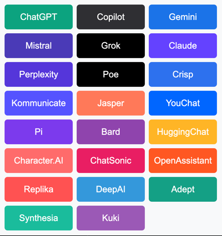

# AI chat buttons - Pop-up Chrome Extension

This is a simple pop-up extension for Google Chrome that displays a set of buttons. Each button links to a different AI chat service. When clicked, it opens the respective AI chat in a new tab.

## Features
- Displays a grid of buttons, each representing a different AI chat.
- Each button opens the corresponding AI chat in a new tab.

## Installation
1. Download the repository.
2. Open Chrome and navigate to `chrome://extensions/`.
3. Enable "Developer mode" at the top-right.
4. Click "Load unpacked" and select the folder where you downloaded the extension.
5. The extension will appear in your toolbar. Click on it to open the pop-up with the buttons.

Enjoy exploring different AI chats!

--- 

Feel free to adjust the GitHub link as needed!